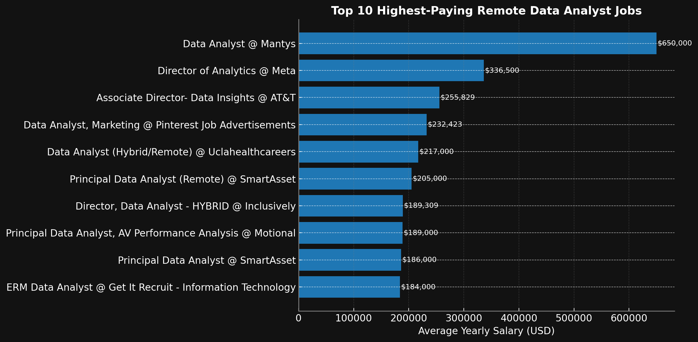
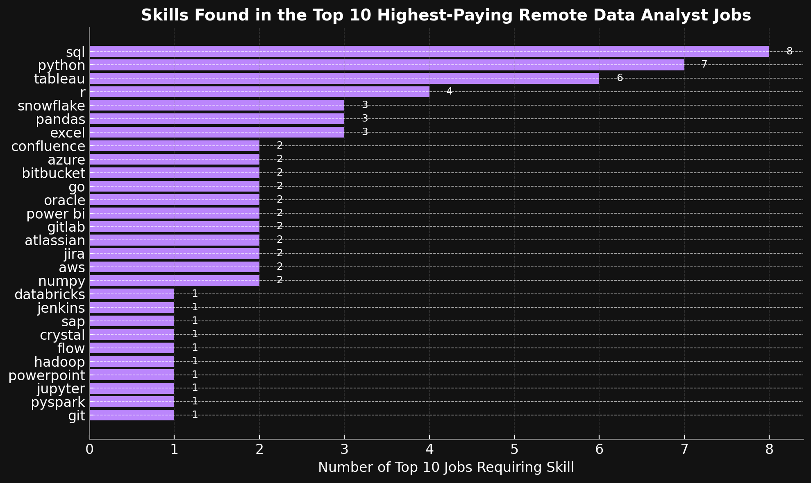
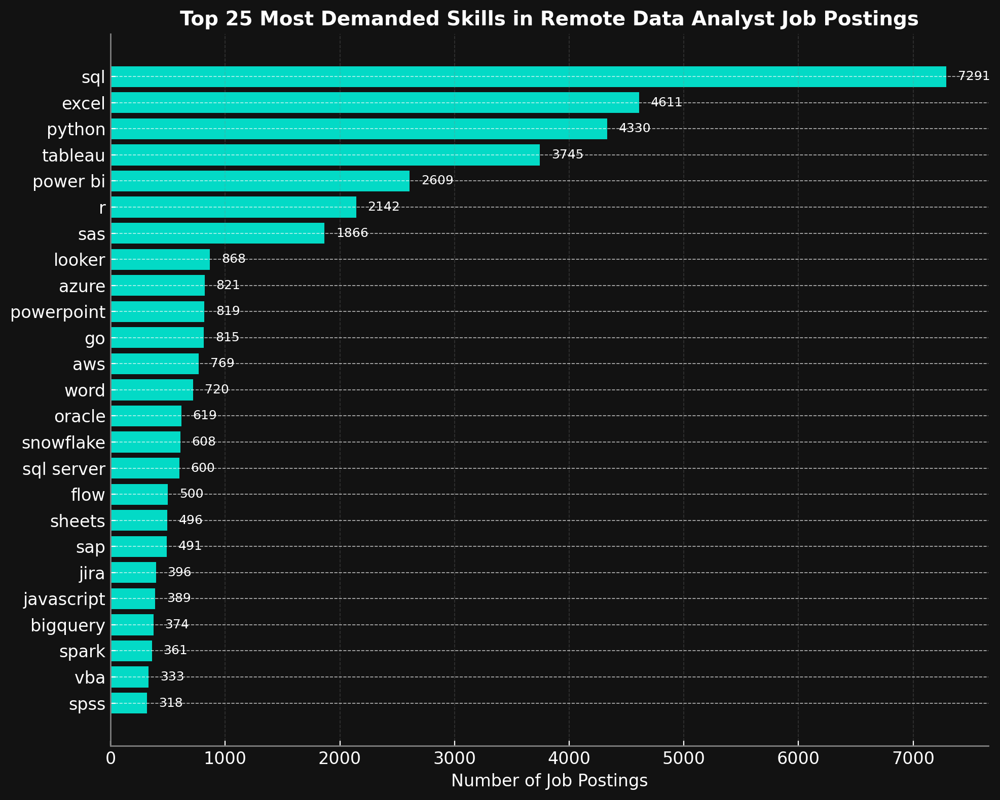
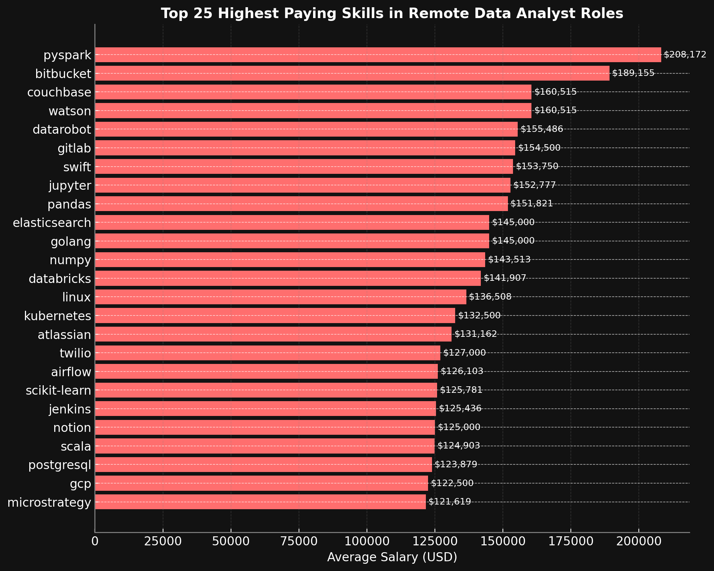
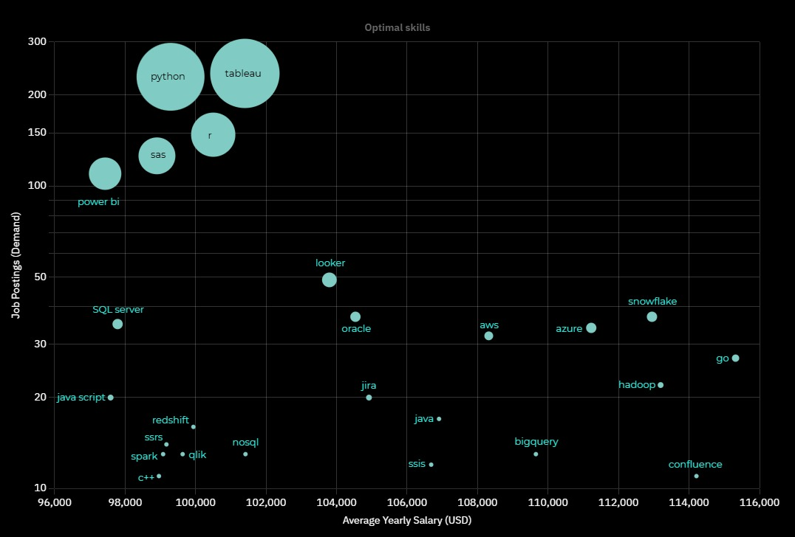

# Remote Data Analyst Job Market — Salary & Skills Analysis (2023)

## 🧠 Introduction
This project explores the remote job market for data analysts in 2023. The goal is to identify high-paying roles and the most in-demand technical skills, using real-world job posting data. The analysis was conducted entirely using SQL and visualized to highlight key findings in a clear and professional manner.

Check out SQL queries here: [Project_SQL folder](/Project_SQL/)

---

## 📊 Live Dashboard (Tableau Public)

**Primary way to view the results:**

[**Tableau Dashboard — Remote Data Analyst Job Market (2023)**](https://public.tableau.com/views/RemoteDAMarketMap/RemoteDAMarketMap?:language=en-US&:sid=&:redirect=auth&:display_count=n&:origin=viz_share_link)   

---

## 🏗️ Background
With the rapid growth of remote work and the evolving expectations in the tech hiring space, data analysts now face an increasingly global and competitive job market. Employers are not only offering higher salaries for top talent but are also demanding a specific mix of technical skills.

### 📊 Dataset Overview
Sourced from [Luke Barousse’s SQL dataset](https://lukebarousse.com/sql), the project uses the following tables:
- **`job_postings_fact`**: Core job data (title, salary, remote status, etc.)
- **`company_dim`**: Company metadata
- **`skills_job_dim`**: Job-to-skill mapping
- **`skills_dim`**: Skill names and categories

This project answers five key questions:
1. What are the top-paying remote data analyst jobs?
2. What skills appear in those high-paying roles?
3. What are the most commonly demanded skills?
4. Which skills are linked to the highest average salaries?
5. Which skills offer the best combination of demand and pay?

## 🛠 Technical Stack
- **SQL (PostgreSQL)** — for querying and analysis
- **Visual Studio Code** — for writing and managing scripts
- **Git & GitHub** — for version control and publishing
- **ChatGPT** — Graph generation and report editing.

## 📊 The Analysis

### Each query for this project aimed at investigating specific aspects of the data analyst job market.

---

### 💼 Question 1: What are the top-paying remote data analyst jobs?

This query filters job postings to include only remote data analyst roles with non-null salary data. It joins the job table with the company table to retrieve employer names, then sorts by average yearly salary and job posting date to identify the top 10 highest-paying opportunities.

```sql
SELECT 
    jpf.job_id,
    jpf.job_title,
    jpf.job_location,
    jpf.job_schedule_type,
    jpf.salary_year_avg,
    jpf.job_posted_date,
    cd.name AS company_name
FROM 
    job_postings_fact AS jpf
LEFT JOIN 
    company_dim AS cd ON jpf.company_id = cd.company_id
WHERE 
    jpf.job_title_short = 'Data Analyst'
    AND (jpf.job_work_from_home = TRUE OR jpf.job_location = 'Anywhere')
    AND jpf.salary_year_avg IS NOT NULL
ORDER BY 
    jpf.salary_year_avg DESC,
    jpf.job_posted_date DESC
LIMIT 10;
```
#### 🖼 Visualization:
 *This horizontal bar chart shows a clear salary drop-off from the top role, followed by a cluster of high-paying positions between $180K and $330K; ChatGPT generated this graph for my SQL query results*

#### 📈 Key Insight:
The highest-paying job was a **basic "Data Analyst" title at Mantys**, listed with an **astonishing $650,000/year**, far above industry norms. Following that were director-level roles at **Meta** and **AT&T**, showcasing how job titles can be deceiving when it comes to salary — some "analyst" roles out-earn "director" roles.

If you’re targeting remote data analyst jobs in 2023, it’s worth digging deeper into companies like Mantys, Meta, and AT&T, as they’re offering the most competitive salaries based on this dataset.

---

### 🧠 Question 2: What skills are most common among the highest-paying remote roles?

Building on Query 1, this query takes the job IDs of the top 10 highest-paying remote data analyst roles and joins them with the skills mapping table. It then links to the skills dimension table to extract the full list of technical skills required by those high-paying positions.

```sql
WITH top_paying_job AS (
    SELECT 
        jpf.job_id,
        jpf.job_title,
        jpf.salary_year_avg,
        cd.name AS company_name
    FROM 
        job_postings_fact AS jpf
    LEFT JOIN 
        company_dim AS cd ON jpf.company_id = cd.company_id
    WHERE 
        jpf.job_title_short = 'Data Analyst'
        AND (jpf.job_work_from_home = TRUE OR jpf.job_location = 'Anywhere')
        AND jpf.salary_year_avg IS NOT NULL
    ORDER BY 
        jpf.salary_year_avg DESC,
        jpf.job_posted_date DESC
    LIMIT 10
)

SELECT
    top_paying_job.*,
    skills_dim.skills
FROM
    top_paying_job
INNER JOIN
    skills_job_dim ON
    top_paying_job.job_id = skills_job_dim.job_id
INNER JOIN
    skills_dim ON
    skills_job_dim.skill_id = skills_dim.skill_id
ORDER BY
    top_paying_job.salary_year_avg DESC;
```
#### 🖼 Visualization:
This horizontal bar chart shows the frequency of each skill mentioned in the top 10 job listings. Many of these roles required **multiple technical tools**, reflecting the hybrid demands of modern data analyst positions; ChatGPT generated this graph for my SQL query reaults*

> #### 📈 Key Insight:
The chart below reveals that **SQL**, **Python**, and **Tableau** appear most frequently across high-paying roles — a reminder that foundational skills still dominate the top tier. Cloud tools like **AWS**, **Azure**, and **Databricks** also show up, highlighting the increasing demand for cloud-savvy analysts.

If you're aiming for top-paying jobs, mastering SQL + Python + Tableau should be a priority, followed by gaining familiarity with cloud tools and data engineering frameworks like Databricks and Spark.

---

### 💼 Question 3: What are the most demanded skills overall?

This query analyzes all remote data analyst jobs, joins job listings with their associated skills, and counts how often each skill appears. It groups by skill name and ranks them by frequency to reveal the 25 most commonly requested technical skills in the market.

```sql
SELECT
    skills_dim.skills,
    COUNT(jpf.job_id) AS job_count
FROM
    job_postings_fact AS jpf
INNER JOIN
    skills_job_dim ON
    jpf.job_id = skills_job_dim.job_id
INNER JOIN
    skills_dim ON
    skills_job_dim.skill_id = skills_dim.skill_id
WHERE
    jpf.job_title_short = 'Data Analyst'
    AND (jpf.job_work_from_home = TRUE OR jpf.job_location = 'Anywhere')
GROUP BY
    skills_dim.skills
ORDER BY
    job_count DESC
LIMIT
    25
```
#### 🖼 Visualization:
The chart shows a long-tail distribution: a few skills (SQL, Excel, Python) are in extremely high demand, while the remaining skills — though still important — appear less frequently. This emphasizes the value of mastering foundational tools first before moving to niche platforms; ChatGPT generated this graph for my SQL query reaults.*

> #### 📈 Key Insight:
The most in-demand skills are no surprise — **SQL** dominates by a wide margin with **7,291 job mentions**, followed by **Excel**, **Python**, and **Tableau**. These tools form the core skill set for nearly every analyst job.

This list reflects market demand, not salary influence. It tells you what skills will get your foot in the door, not necessarily which ones will get you paid the most

---

### 💸 Question 4: Which skills are linked to the highest average salaries?

To determine which skills are most financially valuable, this query joins job postings with skills and computes the average salary for each skill. It then groups the data by skill name and ranks them in descending order of average salary, limited to the top 25.

```sql
SELECT
    skills_dim.skills,
    ROUND(AVG(jpf.salary_year_avg), 0) AS avg_skill_salary
FROM
    job_postings_fact AS jpf
INNER JOIN
    skills_job_dim ON
    jpf.job_id = skills_job_dim.job_id
INNER JOIN
    skills_dim ON
    skills_job_dim.skill_id = skills_dim.skill_id
WHERE
    jpf.job_title_short = 'Data Analyst'
    AND (jpf.job_work_from_home = TRUE OR jpf.job_location = 'Anywhere')
    AND jpf.salary_year_avg IS NOT NULL
GROUP BY
    skills_dim.skills
ORDER BY
    avg_skill_salary DESC
LIMIT
    25
```
#### 🖼 Visualization:
This chart shows the average salary for each of the top-paying skills. While tools like **Pandas** and **Jupyter** also make the list, the highest averages are driven by cloud, engineering, and AI-related tools; ChatGPT generated this graph for my SQL query reaults.*

> #### 📈 Key Insight:
Skills like **PySpark**, **Bitbucket**, **Couchbase**, and **Watson** appear at the top of the list — these are not the most commonly listed tools, but when they do appear, they tend to be in **high-paying roles**. 

This suggests that **specialized or niche skills** often correlate with higher salaries - even if they’re not as widespread.

---

### 🔧 Question 5: What are the most optimal skills for remote data analysts?

This query evaluates both salary and frequency by grouping skills with valid salary data and calculating their average salary and total job count. It filters out low-frequency skills (fewer than 10 postings) and sorts the results to highlight skills that are both lucrative and in steady demand.

```sql
SELECT
    sjd.skill_id,
    sd.skills,
    COUNT(sjd.job_id) AS job_count,
    ROUND(AVG(jpf.salary_year_avg)) AS avg_skill_salary
FROM
    job_postings_fact AS jpf
INNER JOIN
    skills_job_dim AS sjd ON
    jpf.job_id = sjd.job_id
INNER JOIN
    skills_dim AS sd ON
    sjd.skill_id = sd.skill_id
WHERE
    jpf.job_title_short = 'Data Analyst'
    AND (jpf.job_work_from_home = TRUE OR jpf.job_location = 'Anywhere')
    AND jpf.salary_year_avg IS NOT NULL
GROUP BY
    sjd.skill_id,
    sd.skills
HAVING
    COUNT(sjd.job_id) > 10
ORDER BY
    avg_skill_salary DESC,
    job_count DESC
LIMIT
    25
```
#### 🖼 Visualization:
This chart highlights the **intersection of pay and practicality**. Skills shown include their average salary and number of job mentions (in parentheses). Unlike previous queries, this analysis avoids rare skills with inflated salaries and instead focuses on sustainable, high-ROI tools; this graph was generated on draxlr from my SQL query reaults and edited on ACR.*

> #### 📈 Key Insight:
The most “optimal” skills — combining both pay and demand — include:
- **Go**: High salary, moderate demand
- **Snowflake**, **Azure**, **AWS**, **BigQuery**: Strong salaries and significant demand
- **Java** and **SSIS**: Traditional tech stack tools that still command high pay

Skills like Snowflake, Azure, and Go balance great salary prospects with practical job opportunities — making them smart bets for upskilling in 2023.

---

## 🎯 What I Learned
Through this project, I deepened my ability to structure real-world business questions into actionable SQL queries. I gained hands-on experience working with a multi-table relational database, including joins, filtering, aggregation, and subqueries to extract meaningful insights. I also learned how to design queries that balance performance with clarity, especially when ranking, grouping, or limiting results across large datasets.

Beyond SQL, I learned how to translate complex data into clean, visually clear insights. Creating consistent charts reinforced how design impacts readability. I also improved my ability to evaluate job market data critically and communicate findings in a structured, professional format — all key skills for real-world data analyst work.

---
## ✅ Conclusion

### 🔍 Insights from This Project

1. Titles can be misleading — some of the highest-paying “Data Analyst” roles offer compensation rivaling directors or engineers.  
2. Foundational tools like **SQL**, **Excel**, and **Python** are universally in demand across both average and top-paying roles.  
3. Cloud and engineering tools such as **Databricks**, **Azure**, and **PySpark** are commonly linked to the highest salaries.  
4. Some niche or emerging skills (e.g., **Go**, **Watson**, **Bitbucket**) may not be widespread but command top-tier pay when required.  
5. The best skills to learn are those that strike a balance — strong demand and solid pay — such as **Snowflake**, **BigQuery**, and **Azure**.

---

### ✅ Closing Thoughts

This project gave me a grounded, data-driven understanding of the remote job market for data analysts. It helped bridge the gap between learning SQL and applying it to real-world career planning. By focusing on both employer demand and compensation trends, I now feel more confident in how I prioritize my technical growth.

More broadly, this project showed me the power of asking better questions. With the right data and a structured approach, even a simple dataset can uncover valuable insights — whether you're analyzing markets or making career decisions.
